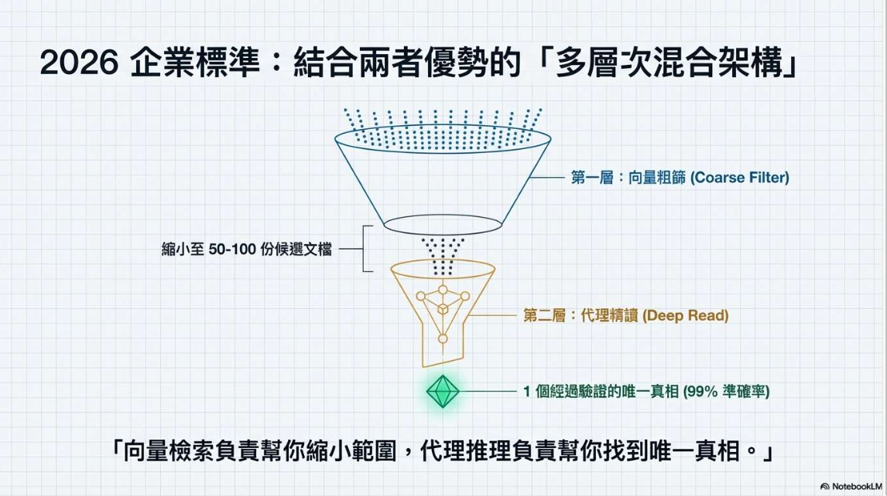
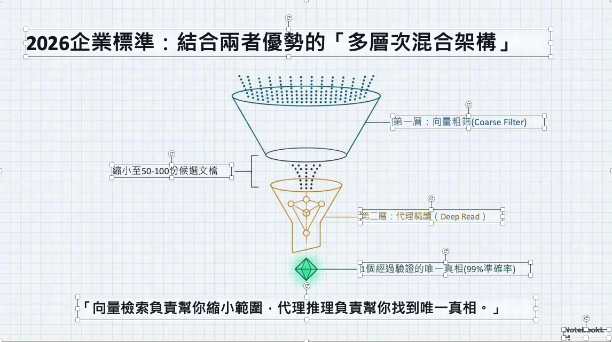

# pdf2ppt

`pdf2ppt` 是一個開源工具，用來把 PDF 投影片轉成可編輯的 PowerPoint (`.pptx`)。

它主要面向簡報型文件，目標是在保留原稿視覺風格的同時，盡可能還原可編輯文字、版面與可重用頁面元素。

核心流程：

- 能直接從 PDF 抽文字與版面的情況，優先使用原生解析。
- 掃描頁或圖片型頁面，再交給 PaddleOCR。
- 先判斷頁面類型（`digital`、`scanned`、`hybrid`），再決定最合適的輸出方式。
- 只有在需要時才做背景重建，而不是一律整頁抹字。
- OCR 文字會額外估算字級、字色與粗體。

## 專案狀態

- 目前建議優先使用的背景引擎：`opencv-fast`
- `diffusion-local` 已移除，因為地端 diffusion inpainting 速度慢且效果不穩定
- 大多數文件建議先從 `opencv-fast` 開始，遮罩過大時再回退到 `white-box`

## 成果展示

<p align="center">
  
  
</p>

<p align="center"><em>左側是原始 PDF，右側是轉換後可編輯的 PowerPoint。</em></p>

## 主要功能

- 將 PDF 轉成可編輯的 PPTX。
- 優先保留原生 PDF 文字。
- 將掃描頁文字重建為 PowerPoint 文字方塊。
- 支援多種背景重建引擎：
  - `white-box`
  - `opencv-fast`（建議優先使用）
  - `auto` 自動路由
- 每次轉換都可輸出 JSON 報告。
- 可輸出逐頁 debug 圖與分析檔，方便檢查 OCR 與背景處理結果。
- CLI 會顯示逐頁轉換進度條。

## 環境需求

- Python 3.11 以上
- 建議使用 Linux
- 依賴套件定義於 `pyproject.toml`
- 若要使用 OCR，建議使用獨立的 Conda 環境並固定 `numpy<2`
- OCR 需要：
  - PaddleOCR 執行環境與模型下載

## 安裝方式

建議的 OCR 執行環境：

```bash
conda create -n ppocr python=3.12 numpy=1.26.4 -y
conda activate ppocr
python -m pip install -e .
```

建議這樣安裝的原因：

- `PaddleOCR` / `PaddleX` 目前在 `numpy<2` 的環境下較穩定。
- 使用獨立 Conda 環境，可降低 `pyarrow`、`scikit-learn` 等全域套件相依衝突。

如果你已經有現成環境，至少請先確認符合 `pyproject.toml` 中的 NumPy 限制：

```bash
python -m pip install "numpy<2"
python -m pip install -e .
```

如果你要執行測試，請另外安裝：

```bash
python -m pip install pytest
```

快速確認環境是否正常：

```bash
python - <<'PY'
import numpy
print(numpy.__version__)
PY
python -m pdf2ppt input.pdf output.pptx
```

## 快速開始

基本轉換：

```bash
pdf2ppt input.pdf output.pptx
```

指定 report 輸出路徑：

```bash
pdf2ppt input.pdf output.pptx --report output.report.json
```

輸出 debug 檔案：

```bash
pdf2ppt input.pdf output.pptx --debug-dir output_debug
```

使用 OpenCV 快速背景重建：

```bash
pdf2ppt input.pdf output.pptx \
  --inpaint-engine opencv-fast \
  --report output.report.json \
  --debug-dir output_debug
```

### `opencv-fast` 的技術原理

`opencv-fast` 是本專案在 `overlay` 頁面上使用的輕量級背景重建路徑。

它的設計目標是：

- 不需要下載模型
- 不需要 GPU
- 直接在本機用 OpenCV 完成
- 對純色、漸層、簡單紋理的投影片背景通常效果最好

技術流程如下：

1. 先找出之後要重建成可編輯 PowerPoint 文字的文字區塊。
2. 透過 `build_text_mask_image()` 把這些文字區域轉成二值遮罩。
3. 可利用 `--inpaint-padding-px` 擴張遮罩，蓋住抗鋸齒邊緣與 OCR 框略小的情況。
4. `OpenCvFastInpaintingEngine` 會把頁面影像轉成 NumPy / OpenCV 格式。
5. 接著呼叫 `cv2.inpaint(..., cv2.INPAINT_TELEA)`，用小半徑做局部修補。
6. 修補後的影像成為背景，再把可編輯文字方塊疊回 PowerPoint。

實作細節：

- 修補演算法：OpenCV Telea 方法（`cv2.INPAINT_TELEA`）
- 預設半徑：`3.0`
- 遮罩格式：8-bit 單通道二值 mask
- 影像流程：PIL RGB -> OpenCV BGR -> Telea 修補 -> PIL RGB

為什麼它很快：

- 它是傳統影像處理，不是生成式模型。
- 核心做法是從遮罩邊界往內推估周邊顏色與結構。
- 主要成本來自影像尺寸與遮罩大小，不需要模型載入與神經網路推論。

適合的情境：

- 純色背景簡報
- 輕微漸層背景
- 文字後方只有簡單紋理或幾何圖形
- 想快速迭代、快速預覽轉換結果

效果較差的情境：

- 文字後方是密集插圖或照片
- 遮罩區域很大
- 複雜圖案無法只靠鄰近像素合理補回
- 被移除的文字剛好壓在重要邊線、圖示或細線圖表上

它與 `auto` 路由的關係：

- `auto` 先看的是文字遮罩面積比例，不是單純看背景複雜度。
- 如果遮罩面積比例不超過 `--inpaint-max-area-ratio`，就直接使用 `opencv-fast`。
- 如果遮罩超過這個門檻，`auto` 通常會為了安全改用 `white-box`。
- 只有一種例外：遮罩雖然稍大，但大部分遮罩區域都落在低紋理背景時，仍可能保留 `opencv-fast`。
- 這個大遮罩例外還有內部上限，因此非常大的遮罩仍會回退到 `white-box`。
- 背景複雜度仍會被估算並寫進 debug note，但它不再是主要分支條件。

常用參數：

- `--inpaint-engine opencv-fast`：強制指定使用此引擎
- `--inpaint-padding-px`：先擴張文字遮罩再修補
- `--inpaint-max-area-ratio`：當遮罩過大時避免使用局部修補
- `--debug-dir`：輸出 mask 與背景決策結果方便檢查

實務建議：

- 一般簡報 PDF 可以先從 `opencv-fast` 開始
- 如果文字邊緣殘留白邊或光暈，可小幅提高 `--inpaint-padding-px`
- 如果 `opencv-fast` 不適合目前的遮罩範圍，改用 `white-box` 會比生成式回填更穩定。

## CLI 參數

主要參數：

- `input_pdf`：輸入 PDF 路徑
- `output_pptx`：輸出 PPTX 路徑
- `--report`：JSON report 輸出路徑
- `--mode`：`editable`、`fidelity`、`fast`
- `--lang`：PaddleOCR 語言代碼，預設為 `ch`
- `--ocr-det-thresh`：PaddleOCR 文字偵測門檻，可選；省略時使用 PaddleOCR 官方預設
- `--ocr-det-box-thresh`：PaddleOCR 偵測框門檻，可選；省略時使用 PaddleOCR 官方預設
- `--ocr-drop-score`：PaddleOCR 辨識分數門檻，可選；省略時使用 PaddleOCR 官方預設
- `--dpi`：OCR 主要使用的頁面渲染 DPI
- `--background-dpi`：嵌入到 PPTX 的整頁背景與 overlay 背景 DPI
- `--background-format`：背景圖輸出格式，`jpeg` 或 `png`；`jpeg` 體積較小
- `--background-jpeg-quality`：當 `--background-format=jpeg` 時使用的 JPEG 品質
- `--debug-dir`：逐頁 debug 圖與分析檔輸出資料夾
- `--enable-doc-unwarping`：啟用 PaddleOCR UVDoc 去扭曲

背景重建相關：

- `--inpaint-engine`：`auto`、`white-box`、`opencv-fast`
- `--inpaint-padding-px`：在 inpainting 前擴張文字遮罩
- `--inpaint-max-area-ratio`：當遮罩面積太大時，強制改用 white-box

診斷相關：

- `--log-level`：`DEBUG`、`INFO`、`WARNING`、`ERROR`

輸出體積調整建議：

- 現在預設會以 `JPEG`、品質 `82`、`110 DPI` 嵌入背景頁面，通常能有效降低 PPTX 大小。
- 如果你更重視畫質，可以提高 `--background-dpi`，或切換成 `--background-format png`。
- 如果檔案仍偏大，可以再降低 `--background-jpeg-quality`。

## 轉換模式

- `editable`：在可編輯性與視覺相似度之間取得平衡
- `fidelity`：更保守，優先維持視覺接近原稿
- `fast`：用較低成本快速產出結果

## 背景重建策略

本專案不會一律對整頁做去字。

實際上會根據頁面狀況選擇不同模式：

- `elements`：盡量保留可編輯元素，不生成整頁背景圖
- `overlay`：只重建可編輯文字下方的背景
- `full-page`：當風險太高時，回退成整頁圖片

在 `overlay` 模式下，`auto` 會依條件選擇：

- `opencv-fast`：當遮罩面積仍在設定門檻內時優先使用
- `opencv-fast`：少數遮罩稍大但大多落在低紋理區域的情況下仍會保留
- `white-box`：當遮罩過大，或局部修補風險過高時作為保底方案

實際判斷順序可以簡化成：

1. 先量測文字遮罩的面積比例。
2. 若不超過 `--inpaint-max-area-ratio`，使用 `opencv-fast`。
3. 若超過門檻，再估算遮罩區域有多少比例屬於低紋理背景。
4. 只有大遮罩例外仍然安全時才保留 `opencv-fast`，否則改用 `white-box`。

## 輸出檔案

常見輸出如下：

- `output.pptx`：可編輯簡報
- `output.report.json`：結構化轉換報告
- `output_debug/`：可選的 debug 輸出

JSON report 會包含：

- 頁面類型判斷
- 背景模式
- 品質分數
- 實際使用的背景重建引擎
- OCR / 原生文字區塊與估算樣式

## 注意事項與限制

- OCR 頁面的重建本質上仍是估算，不是完整語意還原。
- 複雜圖表與向量圖目前較偏向保留外觀，而非完整還原成可編輯圖表物件。
- OCR 的粗體與顏色恢復屬 heuristic 判斷。

## 開發

執行測試：

```bash
python -m pytest -q
```

## 如何啟用 Review UI

如果目前這個 Conda 環境還沒有安裝專案，先執行一次：

```bash
cd /home/justin/pdf2ppt
source /home/justin/miniconda3/etc/profile.d/conda.sh
conda activate ppocr
python -m pip install -e .
```

先在第一個 terminal 啟動後端：

```bash
cd /home/justin/pdf2ppt
source /home/justin/miniconda3/etc/profile.d/conda.sh
conda activate ppocr
python -m uvicorn pdf2ppt.api:app --host 127.0.0.1 --port 8008
```

再在第二個 terminal 啟動前端：

```bash
cd /home/justin/pdf2ppt/frontend
npm install
npm run dev
```

之後用瀏覽器開啟 `http://127.0.0.1:5173`。

補充說明：

- `npm install` 只有第一次安裝或前端依賴變動後才需要重新執行。
- `npm install` 必須在 `frontend/` 目錄下執行，不能在家目錄執行。
- 前端會把 `/jobs/*` 代理到 `8008` port 的 FastAPI 後端。
- 如果同一個 Conda 環境裡還裝了 `iopaint`，或其他較舊的 `gradio` / `fastapi` 套件組合，可能會把 API 相依套件弄壞。遇到這種情況，請重新安裝 `pydantic`、`pydantic-core`、`fastapi`、`starlette`，或直接為 `pdf2ppt` 分出獨立環境。
- 如果你只想跑 CLI 轉檔，不需要啟動這個 review UI。

啟動 review 後端：

```bash
conda activate ppocr
python -m uvicorn pdf2ppt.api:app --host 127.0.0.1 --port 8008
```

啟動 review 前端：

```bash
cd frontend
npm install
npm run dev
```

之後用瀏覽器開啟 `http://127.0.0.1:5173`。Vite dev server 會把 `/jobs/*` 代理到 `8008` port 的 FastAPI 後端。

## Review Workflow

目前專案已包含一個輕量的 OCR 審框前端，適合用在原始 OCR detection 還需要人工複查後，才進入 inpaint 與 PPT 生成的情境。

完整流程如下：

1. 在網頁上傳 PDF，建立 job。
2. 執行 OCR detect，取得逐頁預覽與候選文字框。
3. 逐頁檢查並修改要核准的 boxes。
4. 把 approved boxes 存回後端。
5. 執行 convert，讓 pipeline 優先使用 approved boxes；若手動新增框沒有文字，則在 convert 階段做逐框 recognition，最後輸出 PPTX 與 report。

目前前端已支援：

- 在空白區拖曳建立新框。
- 直接拖曳既有框做平移。
- 用四角 resize handles 視覺化調整框大小。
- 透過 zoom、數值 bbox 欄位與 nudge 按鈕做精細修正。
- 在 inspector 內編輯文字、source、confidence。
- 複製或刪除目前選取的框。
- 若希望手動新增框在 convert 時再做 OCR，可把文字留空。

相關後端 API：

- `POST /jobs`
- `POST /jobs/{job_id}/detect`，可選 `ocr_batch_size` 與 `confidence_threshold`
- `PUT /jobs/{job_id}/boxes`
- `POST /jobs/{job_id}/convert`，可選 `ocr_batch_size`
- `GET /jobs/{job_id}/pages/{page_number}.png`
- `GET /jobs/{job_id}/output.pptx`
- `GET /jobs/{job_id}/report.json`

detect 請求參數補充：

- `confidence_threshold` 會在回應前先過濾掉低於指定信心分數的 OCR 框。
- 預設值：`0.75`

主要檔案：

- CLI：`src/pdf2ppt/cli.py`
- 核心流程：`src/pdf2ppt/pipeline.py`
- 資料模型：`src/pdf2ppt/models.py`

## 文件語言版本

- English：`README.md`
- 繁體中文：`README_tw.md`

## 授權

本專案採用 MIT License，詳見 `LICENSE`。
